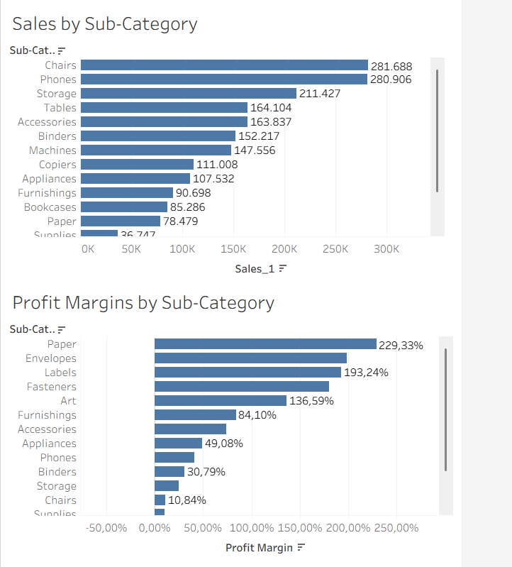
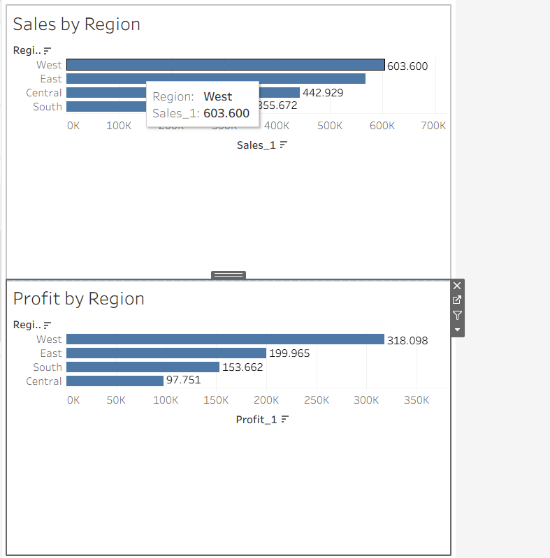
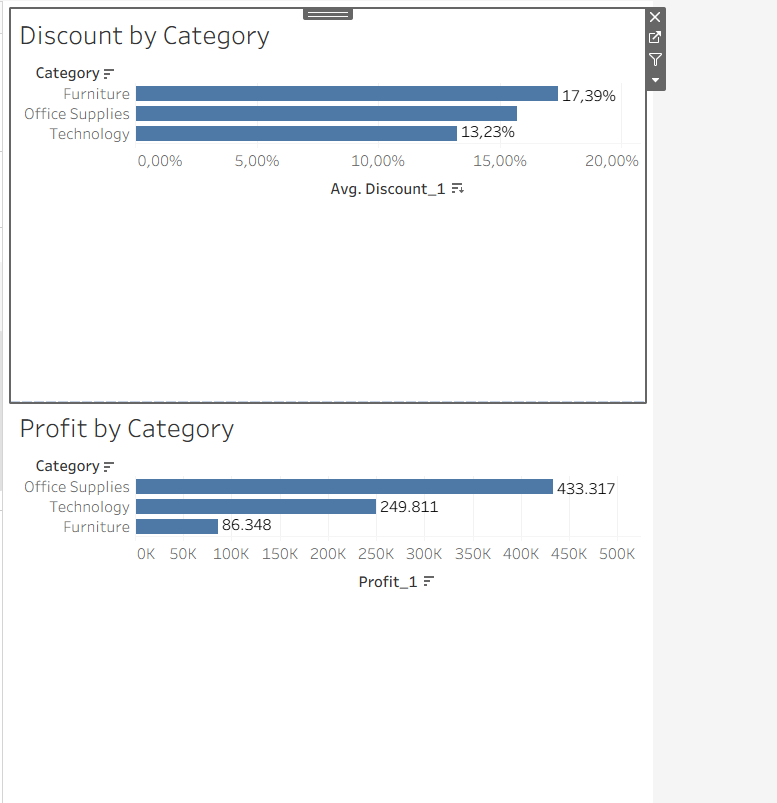

# Supermarket Sales Analysis

This project is a sample **Data Analysis** on a supermarket dataset.  
The goal is to clean the data, extract key KPIs, and build a clear and insightful dashboard.

---

## Dataset Overview
**Columns:**

| Column | Description |
|--------|-------------|
| `Ship Mode` | Shipping method (Standard, First Class, etc.) |
| `Segment` | Customer segment (Consumer, Corporate, Home Office) |
| `Country` | Country (e.g., United States) |
| `City` | Customer’s city |
| `State` | State/Province |
| `Postal Code` | ZIP or postal code |
| `Region` | Region (East, West, Central, South) |
| `Category` | Product category (Furniture, Office Supplies, Technology) |
| `Sub-Category` | Product sub-category (Chairs, Phones, etc.) |
| `Sales` | Total sales amount |
| `Quantity` | Quantity sold |
| `Discount` | Discount applied (%) |
| `Profit` | Profit from the sale |

---

## Analysis Goals
- Understand sales by category and region  
- Calculate total revenue and profit  
- Identify best- and worst-performing products  
- Build a dashboard with key KPIs and filters

---

## Data Cleaning Steps

- Checked for missing values and handled them
- Removed duplicate rows
- Converted data types where necessary (e.g., dates)
- Checked for outliers in `Sales` and `Profit`

---

## Tools Used

- **Python (pandas, matplotlib, seaborn)** for data cleaning and analysis
- **Tableau** for dashboard visualization
- **Git & GitHub** for version control and portfolio hosting

---

## Key KPIs

- **Total Sales:** X €
- **Total Profit:** Y €
- **Average Discount:** Z %
- **Top Categories & Sub-Categories** by sales
- **Sales by Region** and by State

---

## Dashboard Screenshots





---

## Insights

- **Top-seling Categories:**
Technology generated the highest sales, followed by Office Supplies and Furniture.
- **Regional Performance:**
The West Region contributed the largest share of both total sales and profit, while the South Region lagged behind in sales and the Central Region lagged behind in profit.
- **Sub-Category Highlights:**
  - Chairs and Phones are the best-performing sub‑categories in terms of total sales.
  - Tables and Bookcases show low profit margins and sometimes even losses despite decent    sales
- **Profitability Patterns:** Higher discounts do not necessarily lead to higher profits. In this dataset, Furniture shows that despite heavy discounts, profitability remains low.
  - *Furniture* has the highest average discount (≈17.4%) but also the lowest total profit  (≈86,348).
  - *Office Supplies* achieve the highest total profit (≈433,317) with lower average discounts.
  - *Technology* stands in between, with moderate discounts (≈13.2%) and solid profit (≈249,811).


---

## How to Run the Project

1. Clone this repository:
   ```bash
   git clone <https://github.com/katerinabouzouki/financial-project.git>